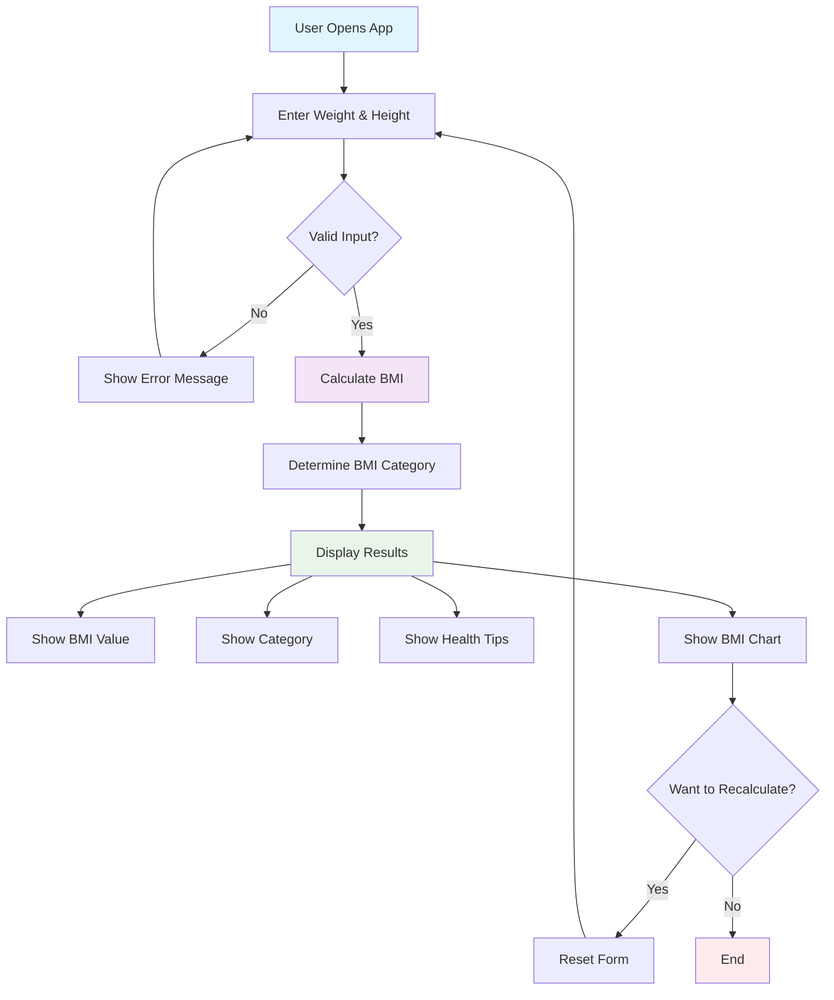

# BMI Calculator



---
## 🎯 Overview

The **BMI Calculator** is a visually appealing, responsive web application that lets users calculate their Body Mass Index (BMI) using either metric or imperial units. It displays the BMI result, category, and personalized health messages, all wrapped in a modern and accessible UI.

---

## ✨ Features

- **Dual Unit Support:** Input height in centimeters or feet/inches; weight in kilograms or pounds.
- **Smart Input:** Dynamic form adapts to selected units (shows feet/inches inputs for imperial).
- **Real-Time Validation:** Prevents invalid/negative values and ensures all required fields are filled.
- **Clear Output:** Shows BMI value, category (Underweight, Normal, Overweight, Obese), and health messages.
- **One-Click Reset:** Instantly recalculate with the "Calculate Again" button.
- **Instant Feedback:** Input errors are caught before calculation, with user-friendly alerts.
- **Animated & Responsive UI:** Stylish gradients, micro-animations, and mobile-first design.
- **Accessible:** Keyboard navigable, large touch targets, color-coded results, and semantic HTML.

---

## ⚙️ How It Works

1. **User opens the app** and is greeted with a clean form.
2. **User enters weight and height,** selecting unit systems as needed.
3. **Form dynamically updates** for unit choices (e.g., shows feet/inches fields for height in ft/in).
4. **Upon 'Calculate BMI',** the app converts units (if necessary), validates inputs, and computes BMI.
5. **Result page** displays BMI value, color-coded category, and personalized health message.
6. **User can reset** to try new inputs or close the app.

---

## 🚀 Live Demo

> To run locally, see [Installation](#installation) below.

---

## 🛠️ Installation

### Prerequisites
- Any modern web browser (Chrome, Firefox, Safari, Edge)
- No dependencies or installation required

### Quick Start

1. **Clone the repository**
   ```bash
   git clone https://github.com/sinha-19/BMI-Calculator.git
   cd BMI-Calculator
   ```

2. **Open in browser**
   - Double-click `index.html`, or
   - Start a local server:
     ```bash
     npx live-server
     # or
     python -m http.server 8000
     ```

---

## 📖 Usage

1. **Enter height** (in cm or ft/in) and **weight** (in kg or lbs).
2. **Click "Calculate BMI".**
3. **View your result** — BMI value, color-coded category, and a personalized health tip.
4. **To recalculate,** click "Calculate Again".

**Validation:**  
- Negative or zero values are rejected.
- All fields must be filled (required).
- Switching units adapts the input form automatically.

---

## 📊 BMI Categories

| BMI Range | Category         | Color         | Health Message                                                   |
|-----------|------------------|--------------|------------------------------------------------------------------|
| < 18.5    | Underweight      | Blue         | "You are underweight. Consider consulting a healthcare provider."|
| 18.5–24.9 | Normal Weight    | Green        | "Congratulations! You have a healthy weight."                    |
| 25.0–29.9 | Overweight       | Orange       | "You are overweight. Consider a healthier lifestyle."            |
| 30.0+     | Obese            | Red          | "You are obese. Consult a healthcare provider for advice."       |

*Based on WHO standards. All messages are shown directly in the app.*

---

## 🖥️ Technologies Used

- **HTML5:** Semantic, accessible markup for forms and results.
- **CSS3:** Responsive, modern, gradient-based styling with Flexbox/Grid and animations.
- **JavaScript (ES6+):** Handles input logic, unit conversion, validation, BMI calculation, and dynamic DOM updates.

---

## 📁 Project Structure

```
BMI-Calculator/
├── index.html    # Main HTML structure and form
├── style.css     # Gradient, responsive, and animated styles
├── script.js     # BMI logic, validation, and UI handling
└── README.md     # Project documentation
```

### Highlights

- **index.html:**  
  - Responsive container
  - Adaptive form (unit selection, dynamic fields)
  - Results card with BMI value, category, message
- **style.css:**  
  - Modern gradients, glassmorphism, card-based design
  - Color-coded category badges
  - Responsive mobile-first breakpoints
  - Smooth button and card animations
- **script.js:**  
  - Handles all unit conversions (cm/inches, kg/lbs)
  - Strict input validation and user feedback
  - Shows/hides inputs based on unit selection
  - Displays BMI category and health tip

---

## 🤝 Contributing

Contributions are welcome!
1. Fork the repository
2. Create a new branch (`git checkout -b feature/YourFeature`)
3. Commit your changes
4. Push to your fork
5. Open a Pull Request

**Tips:**
- Follow consistent code style.
- Add comments for non-obvious logic.
- Test on desktop and mobile.
- Update documentation if needed.

---

## 📝 License

This project is licensed under the MIT License. See the [LICENSE](LICENSE) file for details.

---

## 👨‍💻 Developer

**Developed by Saket Kumar Sinha**
- [GitHub Profile](https://github.com/sinha-19)

---

*Made with ❤️ by Saket Kumar Sinha. If you like it, please star the repo!*
