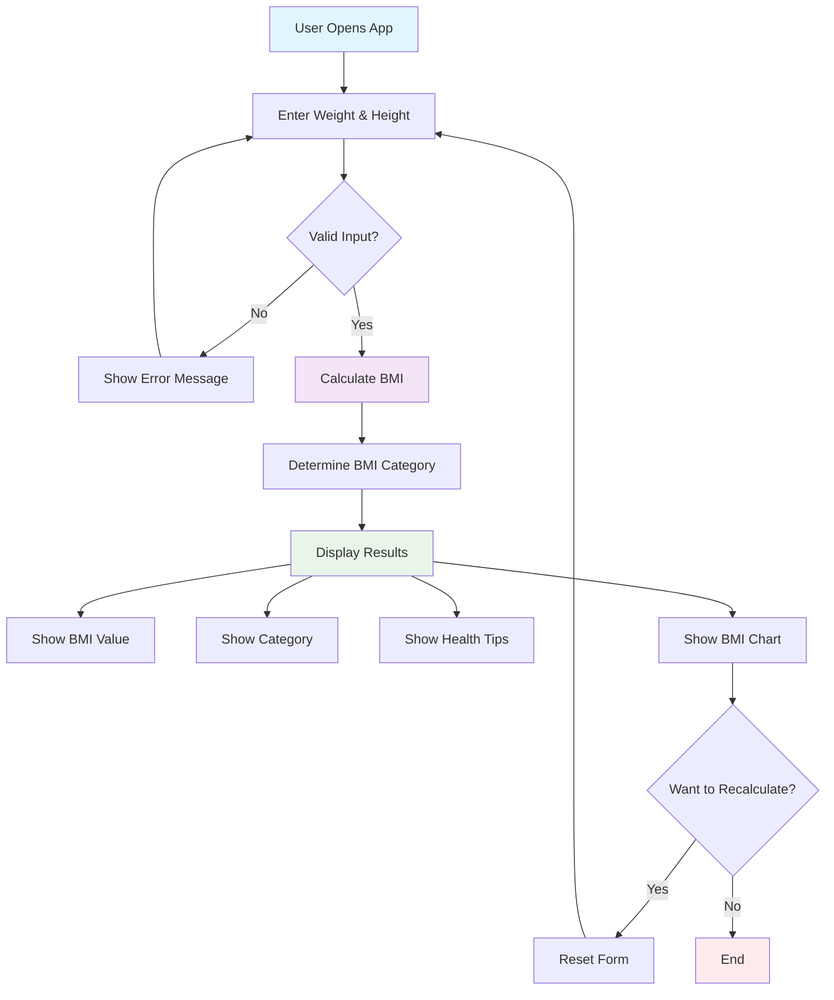

# BMI Calculator



## 📋 Table of Contents
- [Overview](#overview)
- [Features](#features)
- [Demo](#demo)
- [Installation](#installation)
- [Usage](#usage)
- [BMI Categories](#bmi-categories)
- [Technologies Used](#technologies-used)
- [Project Structure](#project-structure)
- [Contributing](#contributing)
- [License](#license)
- [Developer](#developer)

## 🎯 Overview

A modern, responsive BMI (Body Mass Index) Calculator built with pure HTML, CSS, and JavaScript. This application helps users calculate their BMI and provides health insights based on WHO standards.

## ✨ Features

### Core Functionality
- **BMI Calculation**: Accurate BMI calculation using weight and height
- **Multiple Units**: Support for both Metric (kg/cm) and Imperial (lbs/ft-in) systems
- **Real-time Validation**: Input validation with helpful error messages
- **Instant Results**: Immediate BMI calculation and category display

### User Experience
- **Responsive Design**: Works seamlessly on desktop, tablet, and mobile devices
- **Modern UI**: Clean, gradient-based design with smooth animations
- **Interactive Elements**: Hover effects and micro-interactions
- **Accessibility**: Keyboard navigation and screen reader friendly

### Health Insights
- **BMI Categories**: Clear categorization (Underweight, Normal, Overweight, Obese)
- **Health Tips**: Personalized recommendations based on BMI category
- **Visual Indicators**: Color-coded results for quick understanding
- **BMI Chart**: Reference chart showing all BMI ranges

## 🚀 Demo

### Screenshots
```
[User Interface]
┌─────────────────────────────────────┐
│  🏥 BMI Calculator                  │
│  Calculate your Body Mass Index     │
├─────────────────────────────────────┤
│  Weight: [____] kg                  │
│  Height: [____] cm                  │
│  [ Calculate BMI ]                  │
├─────────────────────────────────────┤
│  Your BMI: 22.5                     │
│  Category: Normal Weight            │
│  💡 Health Tips: Maintain your...   │
└─────────────────────────────────────┘
```

## 🛠️ Installation

### Prerequisites
- Modern web browser (Chrome, Firefox, Safari, Edge)
- No additional software required

### Quick Start
1. **Clone the repository**
   ```bash
   git clone https://github.com/sinha-19/bmi-calculator.git
   cd bmi-calculator
   ```

2. **Open in browser**
   ```bash
   # Option 1: Double-click index.html
   # Option 2: Use live server
   npx live-server
   # Option 3: Python server
   python -m http.server 8000
   ```

3. **Start calculating!**
   - Enter your weight and height
   - Click "Calculate BMI"
   - View your results and health tips

## 📖 Usage

### Step-by-Step Guide

1. **Enter Your Details**
   - Input your weight (in kg or lbs)
   - Input your height (in cm or ft/inches)
   - Select your preferred unit system

2. **Calculate BMI**
   - Click the "Calculate BMI" button
   - View your BMI value instantly

3. **Understand Your Results**
   - Check your BMI category
   - Read personalized health tips
   - Reference the BMI chart for context

4. **Recalculate (Optional)**
   - Click "Calculate Again" to reset
   - Try different values or unit systems

### Input Validation
- **Weight**: Must be between 1-1000 kg (or equivalent in lbs)
- **Height**: Must be between 50-300 cm (or equivalent in ft/in)
- **Format**: Numbers only, decimals allowed

## 📊 BMI Categories

| BMI Range | Category | Health Status |
|-----------|----------|---------------|
| < 18.5 | Underweight | May indicate malnutrition |
| 18.5 - 24.9 | Normal Weight | Healthy weight range |
| 25.0 - 29.9 | Overweight | Increased health risks |
| 30.0 - 34.9 | Obese Class I | High health risks |
| 35.0 - 39.9 | Obese Class II | Very high health risks |
| ≥ 40.0 | Obese Class III | Extremely high health risks |

*Based on World Health Organization (WHO) standards*

## 🔧 Technologies Used

### Frontend
- **HTML5**: Semantic markup and structure
- **CSS3**: Modern styling with Flexbox/Grid
- **JavaScript (ES6+)**: Interactive functionality

### Design Features
- **Responsive Design**: Mobile-first approach
- **CSS Grid & Flexbox**: Modern layout techniques
- **CSS Animations**: Smooth transitions and effects
- **Custom Properties**: CSS variables for theming

### Browser Support
- ✅ Chrome 60+
- ✅ Firefox 55+
- ✅ Safari 12+
- ✅ Edge 79+

## 📁 Project Structure

```
bmi-calculator/
├── index.html              # Main HTML file
├── style.css              # Stylesheet
├── script.js              # JavaScript functionality
├── README.md              # Project documentation
└── assets/                # Images and icons (if any)
    └── favicon.ico        # Website icon
```

### File Descriptions

#### `index.html`
- Main application structure
- Form elements for user input
- Results display sections
- Semantic HTML5 elements

#### `style.css`
- Responsive design styles
- Modern CSS features (Grid, Flexbox)
- Animations and transitions
- Mobile-first approach

#### `script.js`
- BMI calculation logic
- Input validation
- DOM manipulation
- Event handling

## 🎨 Customization

### Changing Colors
```css
:root {
  --primary-color: #your-color;
  --secondary-color: #your-color;
  --accent-color: #your-color;
}
```

### Adding New Features
1. **Unit Conversion**: Add more unit systems
2. **History**: Store previous calculations
3. **Charts**: Add BMI trend visualization
4. **Export**: PDF or image export functionality

## 🤝 Contributing

We welcome contributions! Here's how you can help:

### Getting Started
1. Fork the repository
2. Create a feature branch (`git checkout -b feature/AmazingFeature`)
3. Commit your changes (`git commit -m 'Add some AmazingFeature'`)
4. Push to the branch (`git push origin feature/AmazingFeature`)
5. Open a Pull Request

### Contribution Guidelines
- Follow existing code style
- Add comments for complex logic
- Test on multiple browsers
- Update documentation as needed

### Areas for Contribution
- 🐛 Bug fixes
- ✨ New features
- 📚 Documentation improvements
- 🎨 UI/UX enhancements
- ♿ Accessibility improvements

## 📝 License

This project is licensed under the MIT License - see the [LICENSE](LICENSE) file for details.

### MIT License Summary
- ✅ Commercial use
- ✅ Modification
- ✅ Distribution
- ✅ Private use
- ❌ Liability
- ❌ Warranty

## 👨‍💻 Developer

**Developed by Saket Kumar Sinha**

### Connect with me:
- 🌐 Portfolio: [your-portfolio.com]
- 💼 LinkedIn: [linkedin.com/in/yourprofile]
- 🐱 GitHub: [github.com/yourusername]
- 📧 Email: your.email@example.com

### Other Projects
- 🎯 [Whack-a-Mole Game](link-to-project)
- 📅 [Age Calculator](link-to-project)
- 🧮 [More Calculators](link-to-project)

---

## 📈 Project Stats


## 🙏 Acknowledgments

- World Health Organization for BMI standards
- MDN Web Docs for technical references
- CSS-Tricks for design inspiration
- The web development community for continuous learning

---

*Made with ❤️ by Saket Kumar Sinha*

**⭐ If you found this project helpful, please give it a star!**